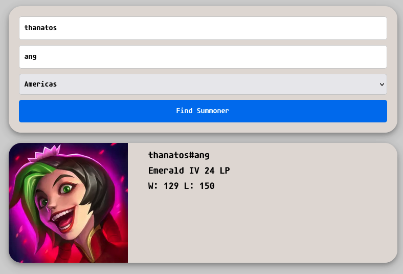

# TFT-Site

Purpose of this project was to learn the route/controller/service architecture and practice front-end.

# Use

To use this project you need to clone the repo, grab an api key from riot docs, and `npm run dev` inside of `frontend/` and `nodemon index`.

# Demo Image

